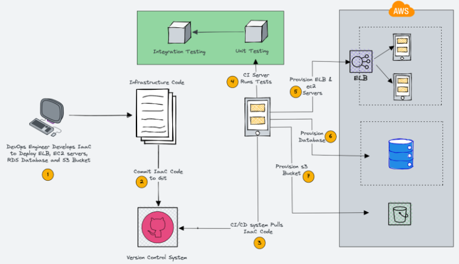
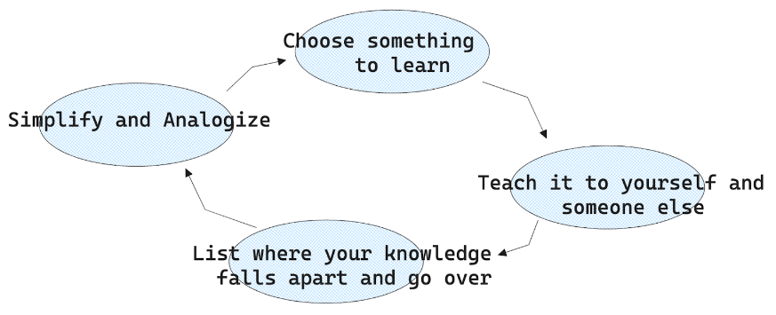

Building Context on New Systems
===

This blog was a re-write of an internal tech talk for Junior Engineers I did at Rokt.

# Intro

I'd like to write a bit about techniques to employ when onboarding knowledge for
a new system. These strategies should aid in accelerating the understanding of a
software system, how to extend the functionality of the system, what its expected
behavior and failure modes are, and the system's dependencies.

Developing in a modern cloud native architecture often leads to the discovery, ownership,
and maintenance of new software systems so building the skill of '*grokking*' quickly
is a powerful tool for junior and senior engineers alike.

*Learning new systems is the norm, not the exception.* Systems change over time. Scope
and responsibilities over systems change over time as well.

The blog is written in the context of a cloud native deployment ecosystem, but the
lessons could easily be adopted even if you aren't slinging YAML at k8s clusters.

# What is a 'System'

This [popular textbook](https://en.wikipedia.org/wiki/Ian_Sommerville_(software_engineer)) states:

> A **software system** is a system of intercommunicating components based on software forming part of a computer system (a combination of hardware and software). It "consists of a number of separate programs, configuration files, which are used to set up these programs, system documentation, which describes the structure of the system, and user documentation, which explains how to use the system"

If we break this down we get the following taxonomy.

**Intercommunicating Components**: This could include other apps, service mesh, load balancers, sidecars, telemetry, et cetera.

**Separate programs**: Services, deployment tools, linters, and test suites.

**Configuration files**: Kubernetes yaml, Infrastructure as Code (terraform, cloudformation), service config

**System and user documentation**: Markdown docs, github docs, wikis, confluence, gdocs, random notebooks, loose pieces of paper, the mutterings of disenfranchised engineers

Below is a diagram which represents many of the 'software systems' which may be involved in deploying a service.

# What is 'Context'

If we want to demonstrate we have built 'context' on a software system what do we
need to have done? A good approach is the Feynman Technique. The process is as follows:

By teaching the concept to someone else we can easily identify where we are not 'rock solid' in our understanding. From this we can go back and review.

You'll know when you have strong context on the software system when you are able to

- Explain the system to someone
- Extend the system safely and proficiently
- Fix the system *when* it breaks

# Good Services

I am of the opinion that good services are services which have a high degree of conveyance.
If I come to some artifact it should be easy for me to understand the purpose, history,
and behavior of the associated software system. For example, if I'm in a repository
it should link to the various docs, dashboards, and associated components relevant
to the system. When building context on a new system you are in the rare position
to experience onboarding 'with fresh eyes'. Don't let this opportunity be wasted!
Write down any difficulties, toe stubs, inaccuracies, and gaps in your onboarding
so you can improve them for the next traveler down the road. Good services have a
high degree of readability in their design.

# Understanding the System's Functionality

## Dive into documentation (both internal and external)

The first place I start with a new system is the docs. Organizations store their
docs via various means and places. Sometimes this is in version control or an internal
wiki, sometimes it's written or spread across various tools. Being able to quickly
navigate and search all sources of information is a valuable workflow an engineer
should build early on at an organization.

Being able to use the advanced search functions of atlassian products, google products,
github, et cetera will pay dividends over time. If you have the budget for it, there
are SaaS products which offer a "supersearch" functionality across disparate data
sources.

When it doubt, [RTFM](https://en.wikipedia.org/wiki/RTFM)

## Reverse engineering when documentation is scarce

The hard truth of it is we don't always have good docs, or docs at all. When this
is the case there are some techniques you can employ in building context. This is
not an exhaustive list.

**Code Analysis**: It's often helpful to start at the entry point of the software (like
the main method in a Java application) and follow the execution flow. Tools like
IDEs with debugging capabilities can be valuable in stepping through code. Look through
any IaC (infra as code) or deployment components. This includes artifacts such as
helm templates and k8s manifests, cloud formation or terraform files, and nasty 1000
line long shell scripts written in the early aughts by a disgruntled and drunk system
administrator. Don't be afraid to jump into the source! If there is a README, docs,
or runbooks. read them! Be sure to understand the standard project structure for
the language and try navigating the directories to the domains of the project.

**Understand the coding style and patterns**: Look for recurring practices and structure
in the codebase, as this can hint at certain design patterns or practices the original
developers followed.

**Identify key modules**: Look for which parts of the system interact with the database,
handle user interfaces, manage business logic, etc.

**Static and Dynamic Analysis Tools**: Use static analysis tools to examine the software
in a non-runtime environment, and dynamic analysis tools to inspect the system at
runtime. This includes linters / type checkers and debuggers.

**Logs and Error Messages**: Reviewing logs can reveal the system's behavior and error
handling procedures, providing clues about how it's supposed to work.

**Testing and Experimenting**: If the system is safely sandboxed, try experimenting with
it. Make a change and see what happens. This is a practical, hands-on way of understanding
the system. Some systems allow a safe 'side-by-side' deployment which you can specifically
route traffic to. If there is a test suite, try running it. If you can run it on
your host machine or in a local sandbox, do that. If there is a staging environment
try hooking into it. Be sure you understand how it's built and try to reproduce the
process.

**Database Schema and Data Analysis**: Reviewing the database schema can offer insights
into the data model of the system, helping you understand what kind of data the system
deals with and how it's structured.

**Network Analysis**: Tools like [Wireshark](https://www.wireshark.org/) or [Fiddler](https://www.telerik.com/fiddler)
can be used to inspect network traffic in and out of the system. This can give insights
into what other systems yours interacts with and the behavior of that interaction.
If your architecture has a service mesh you can try to introspect it for more insights
into the services runtime behavior.

**Community Resources**: If the system is open-source or widely used, there may be unofficial
documentation, discussion forums, or Q&A threads online. Sites like StackOverflow,
GitHub, or the software's community forums may have threads that can provide additional
insights.

## Engage with the community

With the internet at your fingertips you have access to a vast population of experts and communities willing to provide you bad--and sometimes good--advice. Some great places to start are:

- IRC
- Forums
- Github
- Slack
- Discord
- Meetups
- Stack Overflow

# Identifying System Dependencies

Once you have a decent understanding of the local system you should ensure you have
a good understanding of its dependencies. This could be internal dependencies like
the framework du jour or a critical library you use. It may also be external dependencies
like a datastore or another service you are downstream from. All production systems
are unique and special in their own way and so some of the following techniques may
not apply to your use case.

If you're running a service mesh like [istio](https://istio.io/) you can use the telemetry and potential
[ServiceEntry](https://istio.io/latest/docs/reference/config/networking/service-entry/)
files provided to understand what depends on your system and what your system depends
on. Tools like [Datadog](https://datadog.com/) will provide a slick user interface for accessing this data
among other tools to observe your system.

If you drink from the fountain of chaos you can run a "Gameday" to test dependencies.
Introducing failures can be a great way to see in practice what is really needed
for production operations. This could be one of:

- Config level removal
- DNS level removal
- TCP level removal
- Code Removal
- Network Failure Tools

If you're fully containerized try to get a working local setup using a tool like
[docker-compose](https://docs.docker.com/compose/). This will allow really short cycle times as you poke around to understand
the dynamics of the system. If you have a container repository and have access to
it you can pull down pre-built containers to speed this up.

# Expected Behavior and Failure Modes

Define the system's standard operation: Start with understanding what the system
is supposed to do under normal conditions. This usually means the system is operating
with valid inputs and is not under any sort of distress (like high load, low memory,
etc).

- Inputs: Determine what kind of inputs the system accepts. This might include user interactions, API requests, or files to process.
- Processes: Understand how the system processes these inputs. This involves identifying the business logic that transforms inputs into outputs.
- Outputs: Define what the expected results or effects of these processes are. This could be anything from rendering a web page, writing a file, or sending a response to another system.

Understand common user flows: This involves understanding how users typically interact
with the system and how the system behaves in response.

- User Actions: Map out the most common actions that users take when they interact with the system. These are often tasks that the system was primarily designed to handle.
- System Responses: Document how the system responds to each of these actions. This could be anything from returning a result, updating the database, or triggering an event.
- Edge Cases: Don't forget about less common or unintended user actions. Understanding how the system responds to unexpected inputs or actions can provide insights into its robustness and error handling procedures.

Construct Flow Diagrams: Visualizing these processes and interactions can be helpful.
You can use flowcharts or sequence diagrams to map out these flows. They can be invaluable
resources for both the current onboarding process and future team members.

Perform Walkthroughs: Physically walking through these user flows in the system is
an excellent way to ensure your understanding matches the reality of how the system
behaves.

# Outro

Mastering the art of quickly understanding and integrating into new software systems
within a cloud-native framework is crucial for engineers at all levels. By prioritizing
the acquisition of context, understanding system functionality, and identifying dependencies,
we equip ourselves to contribute effectively and navigate the complexities of modern
architectures. Embracing techniques such as documentation review, code analysis,
experimentation, and community engagement empowers us to overcome challenges and
accelerate our onboarding process. Ultimately, by comprehensively defining system
behavior, mapping user flows, and leveraging visualization tools, we can ensure a
robust understanding that not only benefits our own work but also sets the stage
for seamless collaboration and knowledge transfer within our teams. So, let's embrace
the journey of exploration and discovery as we dive into new systems, armed with
the tools and techniques outlined here, ready to thrive in the ever-evolving landscape
of cloud-native development.
