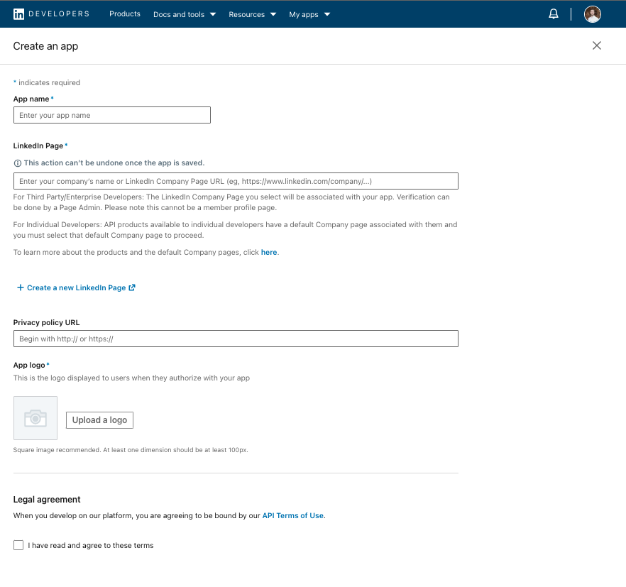
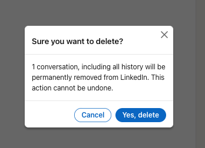

Clearing my Linkedin Inbox
===

I wanted to inbox zero my linkedin inbox. At first I thought I could do this via the LinkedIn API.

```python
headers = {"Authorization": f"Bearer {access_token}"}

# Example of fetching messages - the actual endpoint and method might differ
messages_response = requests.get("https://api.linkedin.com/v2/messages", headers=headers)
messages = messages_response.json()

# Example of deleting a message - this is hypothetical
for message in messages:
    delete_response = requests.delete(f"https://api.linkedin.com/v2/messages/{message['id']}", headers=headers)
    if delete_response.status_code == 204:
        print(f"Message {message['id']} deleted successfully")
    else:
        print(f"Failed to delete message {message['id']}")
```

This was a non-starter though because the linkedin dev portal requires a company page.



Since I couldn't be bothered with this I went the JS via console route.

On your [linkedin.com/messaging/](https://www.linkedin.com/messaging/thread/new/) page you can manually select around 10
messages and delete them.

# This is slow and painful.

Automating the click is trival.

```javascript
function clickAllCheckboxes() {
  const labels = document.querySelectorAll(
    'label.msg-selectable-entity__checkbox-label.ml2[aria-label="Select conversation"]'
  );
  labels.forEach(label => {
    label.click();
  });
}
```

After clicking the delete icon there is another confirmation modal.



We can easily trigger the browser to click both of these.

```javascript
function clickDeleteButton() {
  const deleteButton = document.querySelector('button[title="Delete"][aria-label="Delete"]');
  if (deleteButton) {
    deleteButton.click();
  }
}

function clickConfirmDeleteButton() {
  const confirmDeleteButton = document.querySelector('button[aria-label="Yes, delete selected conversations"]');
  if (confirmDeleteButton) {
    confirmDeleteButton.click();
  }
}
```

If we want to chain and loop these actions, we have trigger them ~1 second apart and return a promise for further
chaining.


### There are likely better ways to write this but we're moving fast here and the script is to be tossed out.

Don't let perfection get in the way of deleting spam emails.

```javascript
function performDeletionSequence() {
  return new Promise(resolve => {
    clickAllCheckboxes();
    setTimeout(() => {
      clickDeleteButton();
      setTimeout(() => {
        clickConfirmDeleteButton();
        resolve();
      }, 1000);
    }, 1000);
  });
}
```

Finally, we loop forever and wait for a 10,000s of spam messages in linkedin to evaporate. Perfect inbox zero.

```javascript
function performDeletionInfinitely() {
  performDeletionSequence().then(() => {
    setTimeout(() => {
      performDeletionInfinitely();
    }, 4000);
  });
}

performDeletionInfinitely();
```

While there is almost definitely a better way to do this, it was a fun exercise and solved a problem.
